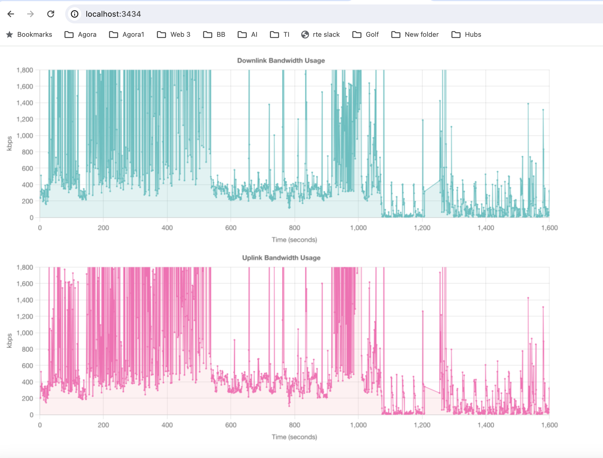
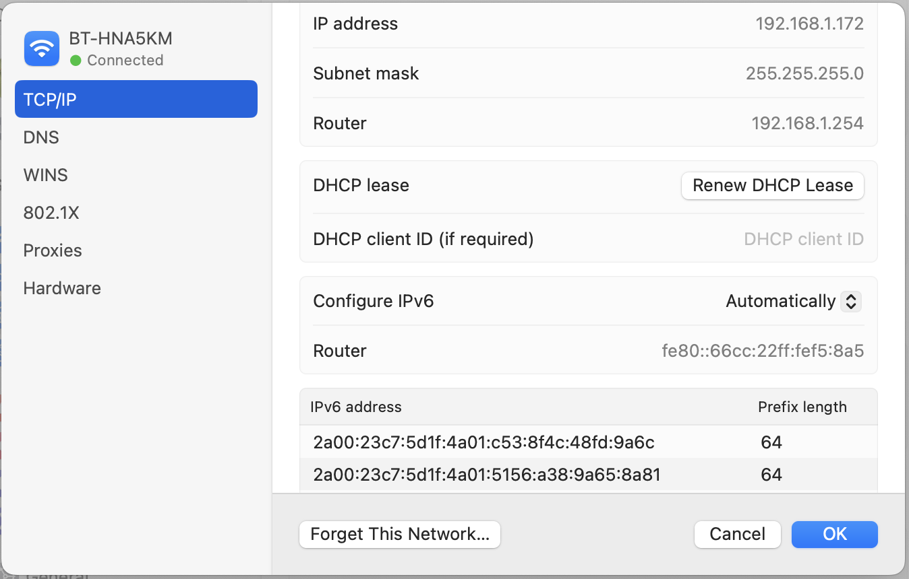

# bandwidthMonitor

## Setup ChartJS Node Project

### Clone Me
Clone this git repo on your mac and cd into the folder      

      $ git clone https://github.com/BenWeekes/bandwidthMonitor

### Install brew, nvm, node
https://dev.to/ajeetraina/how-to-install-and-configure-nvm-on-mac-os-5fgi

### Load latest node version

      $ nvm use --lts

### Install libs used to generate graphics

      $ brew install pkg-config cairo pango libpng jpeg giflib librsvg

### Install Project Node Packages

      $ npm i

## Install wireshark (includes tshark)
https://www.wireshark.org/download/osx/

## Run ChartJS Node Project

### start the project

      $ npm run dev

### view the graph
http://localhost:3434/

## Run tshark

### Find your local IPs 
Open settings > Network > Wi-Fi > Details > TCP/IP

Note your local IP v4 and IP v6 (x2) addresses

### Run the capture 
substitute your IPs in the command below and run in a new terminal window    

      $ sudo ./capture.sh "192.168.1.172" 

 
